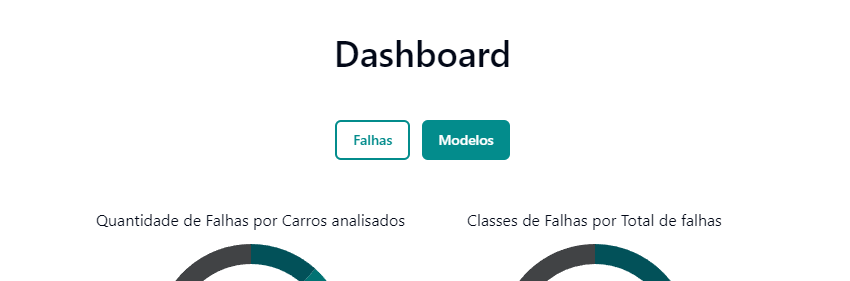
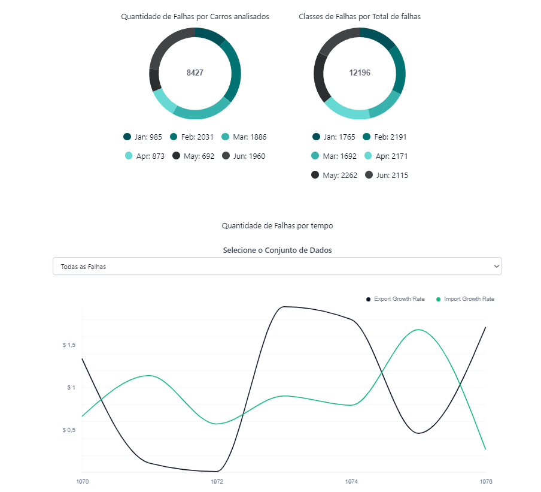
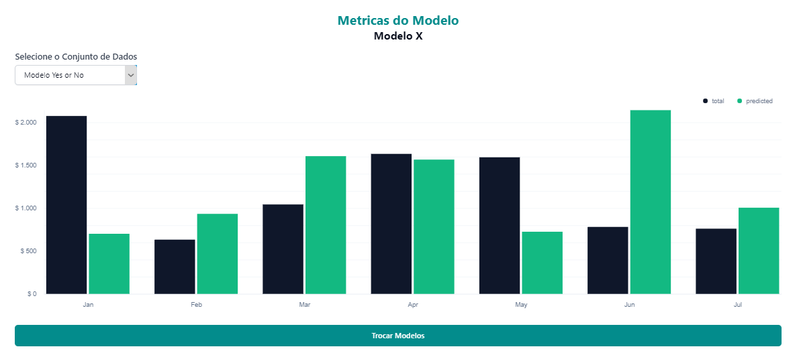

A visualização de dados do projeto foi dividida em duas partes principais: 

1. Visualização dos dados referentes às falhas na fabricação de automóveis, que contém três gráficos.
2. Visualização das métricas dos modelos de predição, que possui um gráfico.

Ao acessar a aba "Dashboards", o usuário poderá navegar entre essas visualizações por meio de botões, como mostrado na imagem abaixo.

---

## Falhas

A tela de falhas apresenta três gráficos para que o usuário possa obter informações relevantes dos dados coletados. Estes gráficos incluem dois gráficos de pizza e um gráfico de linha temporal.

- **Gráfico 1 (Gráfico de Pizza):** Indica a porcentagem de carros com falhas em comparação ao total de carros analisados.
  
- **Gráfico 2 (Gráfico de Pizza):** Mostra a participação de cada tipo de falha no total de falhas encontradas, permitindo identificar quais são as mais frequentes.

- **Gráfico 3 (Gráfico de Linha Temporal):** Exibe a variação do número de falhas ao longo dos meses. Esse gráfico possui um dropdown que permite filtrar os dados por classe específica de falhas.

---

## Modelo

Essa tela tem como objetivo exibir as métricas dos modelos de predição, apresentando um gráfico de barras que mostra as métricas de avaliação em porcentagem.

- **Gráfico de Barra:** Exibe as métricas de avaliação dos modelos. Há um filtro que permite selecionar qual dos 10 modelos disponíveis terá suas métricas exibidas. Além disso, o gráfico possui uma barra mais escura que serve como uma meta, definida pelo usuário, para comparar os resultados dos modelos. Essa barra atua como uma espécie de régua de avaliação.

